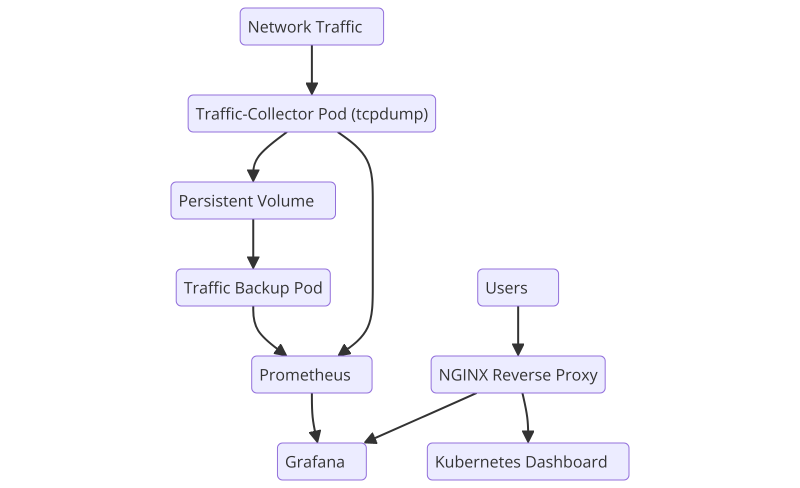

# Architecture Overview

This page provides an overview of the architecture for the Kubernetes-based network monitoring system. The diagram below shows how the different components (Pods, Prometheus, Grafana, NGINX) interact with each other.

## Diagram of Data Flow
The diagram below represents the flow of network traffic from the traffic-collector pod to the Prometheus exporters, which export the data to Prometheus. Grafana then visualizes the metrics, while the NGINX reverse proxy secures external access.

## Component Breakdown
- **Traffic-Collector Pod:** Collects the network traffic and sends it to a Prometheus exporter for monitoring.
- **Traffic-Backup Pod:** Backs up network traffic and is also monitored by its own Prometheus exporter.
- **Monitoring Pod (Prometheus):** Hosts Prometheus, which scrapes metrics from the Prometheus exporters on both the traffic-collector and traffic-backup pods.
- **Kubernetes Dashboard Pod:** Provides a UI for managing and monitoring the Kubernetes cluster. This is accessed through the NGINX reverse proxy for security.
- **Prometheus Exporters:** Export metrics from both the traffic-collector and traffic-backup pods to Prometheus.
- **Prometheus:** Scrapes metrics from both exporters and stores them for analysis and visualization.
- **Grafana:** Visualizes the data collected by Prometheus in a user-friendly dashboard.
- **NGINX Reverse Proxy:** Provides secure external access to the system and ensures only authorized users can interact with the cluster.

## Network Security
The **NGINX reverse proxy** is a critical part of the architecture, as it secures access to the network. All incoming traffic must pass through the reverse proxy, ensuring that only authorized users can access the Kubernetes Dashboard, Grafana, and other services.

## Data Flow Explained
Here’s a step-by-step flow of data within the system:

1. **Network traffic** is captured by the **Traffic-Collector Pod**.
2. The **Prometheus Exporter** collects metrics from the traffic-collector and traffic-backup pods.
3. These metrics are scraped by **Prometheus**.
4. The metrics are visualized in real-time using **Grafana**.
5. The **Traffic Backup Pod** ensures that network traffic data is regularly backed up to avoid data loss.
6. The **Kubernetes Dashboard Pod** provides a UI to manage the cluster, accessible via the **NGINX Reverse Proxy**.
7. **NGINX Reverse Proxy** ensures that the entire system is secured, and only authorized users can access the system from the outside.
